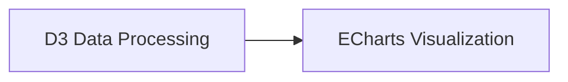
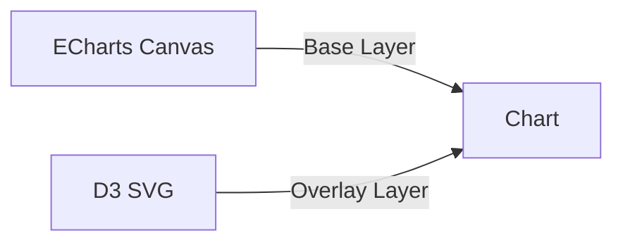

# System Patterns: @tryft/echarts

## Architecture Overview

### Component Architecture Pattern

The library follows a layered component architecture where:

- **BaseEChart**: Core wrapper around ECharts with common functionality
- **Specific Charts**: Extend BaseEChart with chart-specific configuration generation
- **Type System**: Comprehensive TypeScript interfaces for all chart types
- **Hook System**: Reusable logic for ECharts instance management

### Key Design Patterns

#### 1. Composition over Inheritance

- All chart components use the same `BaseEChart` as foundation
- Chart-specific logic is composed through props and configuration generation
- No complex inheritance hierarchies

#### 2. Props-to-Config Transformation

- Simple React props are transformed into ECharts option objects
- Allows both simple and advanced usage patterns
- Maintains ECharts power while providing React convenience

#### 3. Progressive Enhancement

- Basic props provide good defaults
- Advanced props enable customization
- Custom option prop allows full ECharts control

## Component Relationships

```
BaseEChart (Core)
├── useECharts (Hook)
├── EChartsRef (Interface)
└── Chart Components
    ├── LineChart
    ├── BarChart
    ├── PieChart
    ├── TreeChart
    ├── TreemapChart
    ├── GaugeChart
    └── GraphChart
```

### BaseEChart Pattern

```tsx
// Core wrapper that all charts extend
export const BaseEChart = forwardRef<EChartsRef, BaseEChartsProps>(
  ({ option, onChartReady, onEvents, ...props }, ref) => {
    const { chartRef, chartInstance } = useECharts(option, ...);

    // Common chart setup, event handling, lifecycle management
    return <div ref={chartRef} {...props} />;
  }
);
```

### Chart Component Pattern

```tsx
// All specific charts follow this pattern
export const SpecificChart = forwardRef<EChartsRef, SpecificChartProps>(
  ({ data, customProp, option: customOption, ...props }, ref) => {
    const option = useMemo(() => {
      // Generate ECharts option from simple props
      const generatedOption = generateChartOption(data, customProp);

      // Allow custom option override
      return customOption ? { ...generatedOption, ...customOption } : generatedOption;
    }, [data, customProp, customOption]);

    return <BaseEChart ref={ref} option={option} {...props} />;
  },
);
```

## Critical Implementation Patterns

### 1. Rich Text Label Generation

All charts implement rich text labels using ECharts' rich text formatting:

```tsx
formatter: (params: any) => {
  return [
    `{title|${name}}`,
    value !== '' ? `{value|${value}}` : ''
  ].filter(Boolean).join('\n');
},
rich: {
  title: { fontSize: 14, fontWeight: 'bold', color: '#2c5aa0' },
  value: { fontSize: 12, fontWeight: 600, color: '#d73027' }
}
```

### 2. Detailed Tooltip Pattern

Consistent tooltip structure across all components:

```tsx
tooltip: {
  formatter: (params: any) => {
    return `
      <div style="padding: 8px 12px; line-height: 1.6;">
        <div style="font-size: 16px; font-weight: bold; color: #2c5aa0;">
          ${title}
        </div>
        <div style="margin-bottom: 4px;">
          <span style="font-size: 12px; color: #666;">LABEL:</span>
          <span style="font-size: 14px; color: #value-color;">${value}</span>
        </div>
      </div>
    `;
  };
}
```

### 3. TypeScript Interface Hierarchy

```tsx
// Base interface for all charts
interface BaseEChartsProps {
  option?: EChartsOption;
  width?: string | number;
  height?: string | number;
  // ... common props
}

// Specific chart interfaces extend base
interface LineChartProps extends BaseEChartsProps {
  data?: LineData[];
  series?: LineSeries[];
  // ... specific props
}
```

### 4. Ref Pattern for Chart Access

```tsx
interface EChartsRef {
  getEchartsInstance: () => ECharts | null;
  refresh: () => void;
}

// Usage allows advanced operations
const chartRef = useRef<EChartsRef>(null);
const instance = chartRef.current?.getEchartsInstance();
```

## Data Flow Patterns

### 1. Props → Configuration → Rendering

```
User Props → useMemo(generateOption) → BaseEChart → useECharts → ECharts Instance
```

### 2. Event Flow

```
ECharts Events → onEvents prop → User Handlers
Chart Ready → onChartReady → User Setup
```

### 3. Update Cycle

```
Props Change → Option Regeneration → ECharts setOption → Chart Update
```

## Component Design Principles

### 1. Single Responsibility

- Each chart component handles one chart type
- BaseEChart handles common ECharts functionality
- useECharts hook manages instance lifecycle

### 2. Open/Closed Principle

- Components are open for extension via custom option prop
- Closed for modification of core functionality

### 3. Dependency Inversion

- Charts depend on BaseEChart abstraction
- BaseEChart depends on useECharts hook
- No direct ECharts dependencies in chart components

## Performance Patterns

### 1. Memoization Strategy

- Chart options are memoized with useMemo
- Dependencies carefully managed to prevent unnecessary re-renders
- Ref forwarding for direct chart instance access

### 2. Lazy Loading Support

- Components designed for dynamic imports
- Tree-shaking friendly exports
- Minimal bundle impact for unused components

### 3. Update Optimization

- ECharts setOption called only when option changes
- Event handlers preserved across re-renders
- Chart instance reused when possible

## D3.js Integration Patterns

### When to Use D3.js vs ECharts

- **Use ECharts for**:
  - Standard chart types (line, bar, pie, etc.)
  - Quick implementation of common visualizations
  - Built-in interactivity and tooltips
- **Use D3.js for**:
  - Highly custom visualizations not covered by ECharts
  - Advanced data manipulation and transformation
  - Complex interactions and animations

### Integration Approaches

1. **Data Processing Pipeline**:



2. **Custom Visualization Components**:


3. **Combined Rendering**:



### Performance Considerations

- Use D3 for data prep, ECharts for rendering
- Avoid overlapping DOM operations
- Memoize expensive D3 computations
- Use Web Workers for intensive data processing

### Type Safety Patterns

```tsx
// D3 function with generics
function processData<T>(data: T[]): ProcessedData<T> {
  // D3 processing logic
}

// Integration with ECharts
const processed = processData(rawData);
const option = generateEChartsOption(processed);
```

## Code Quality Standards

### TypeScript Strict Compliance

#### 1. **NO `any` Types Policy**

- **Rule**: Never use `any` type in any code - use proper TypeScript types
- **Alternatives**:
  - Use `unknown` for truly unknown types
  - Create specific interfaces for complex objects
  - Use union types for multiple possible types
  - Use generic constraints for flexible but typed code

```tsx
// ❌ BAD - Never do this
function handleClick(event: any) { ... }

// ✅ GOOD - Use proper types
function handleClick(event: MouseEvent) { ... }
function handleClick(data: unknown) { ... }
function handleClick(nodeData: DAGNode, params: unknown) { ... }
```

#### 2. **Unused Parameter Naming**

- **Rule**: Prefix unused parameters with underscore (`_`)
- **Rationale**: Prevents ESLint errors while maintaining function signatures

```tsx
// ✅ GOOD - Unused parameters prefixed
const onNodeClick = (nodeData: DAGNode, _params: unknown) => {
  console.log('Clicked:', nodeData.name);
  // params not used, hence prefixed with _
};
```

#### 3. **Type Safety Patterns**

```tsx
// Complex object typing with type assertions
const connectivity = (
  nodeData as DAGNode & {
    _connectivity?: {
      incoming: unknown[];
      outgoing: unknown[];
    };
  }
)._connectivity;

// Generic function patterns
function processData<T extends BaseData>(data: T): ProcessedData<T> {
  // Implementation with proper typing
}
```

### ESLint Integration

- **Pre-commit hooks**: Automatically check for `any` types and unused parameters
- **Build process**: Fails on TypeScript strict mode violations
- **Development**: VS Code shows real-time TypeScript errors

## Error Handling Patterns

### 1. Graceful Degradation

- Invalid data props result in empty charts, not crashes
- TypeScript prevents many runtime errors
- Clear error messages for development

### 2. Development vs Production

- Development: Detailed error messages and warnings
- Production: Silent handling with fallbacks
- TypeScript: Compile-time error prevention
